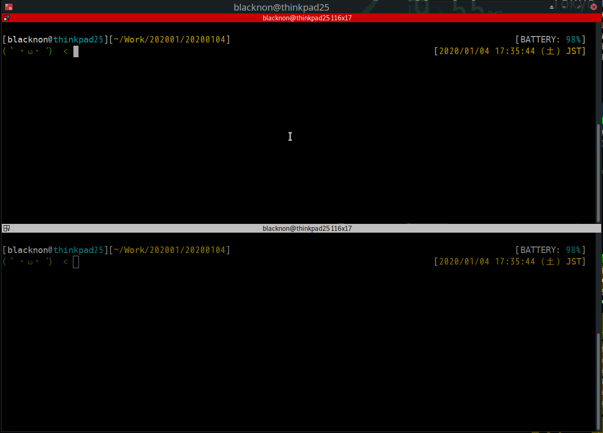
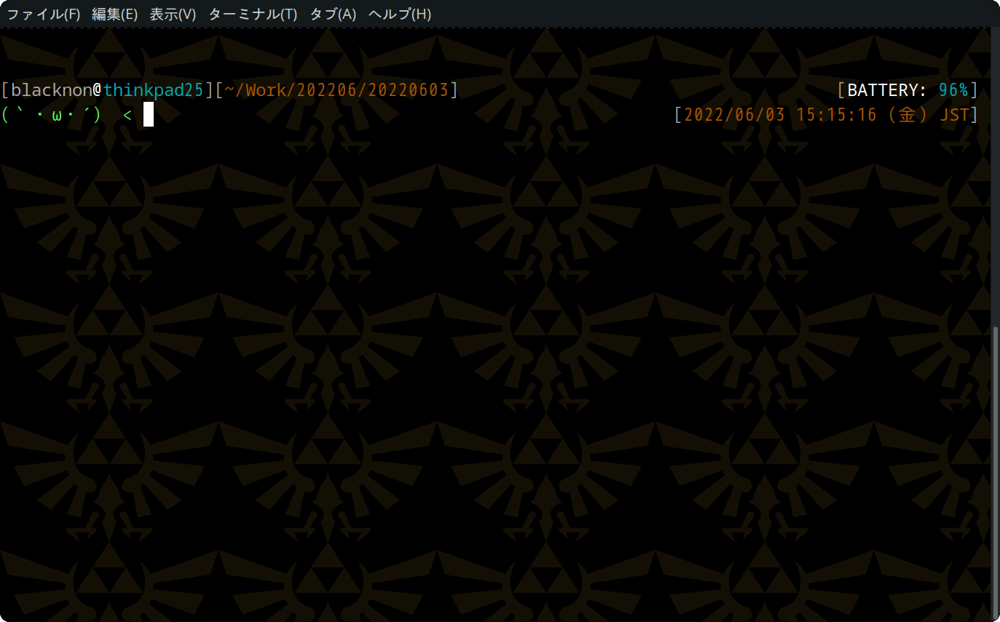
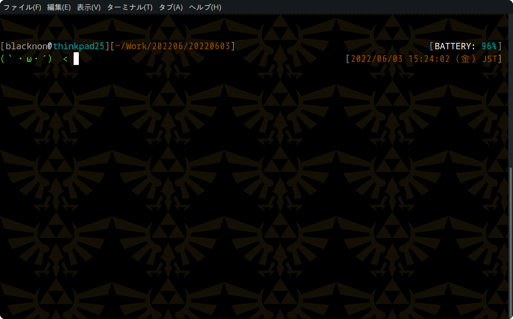
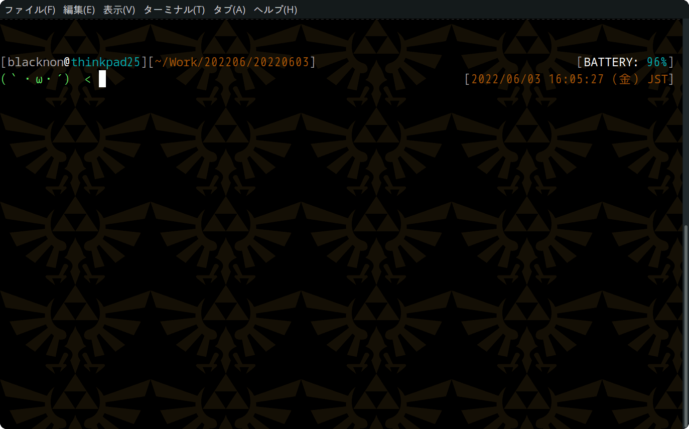
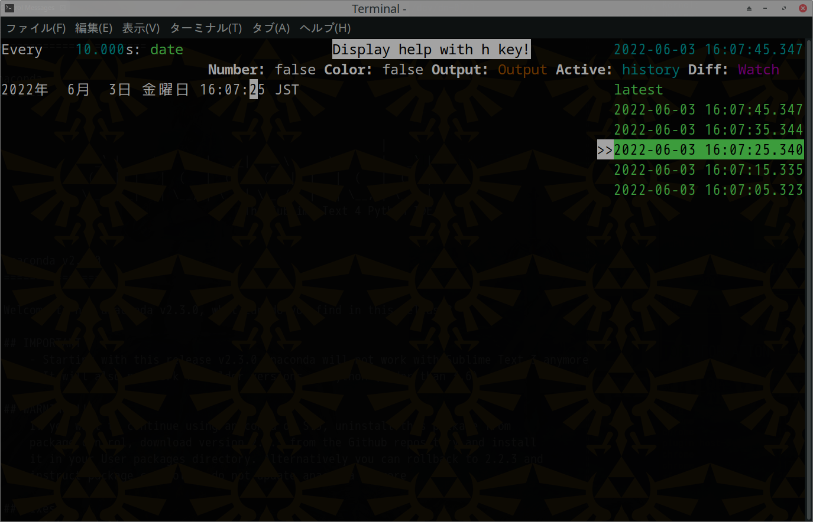
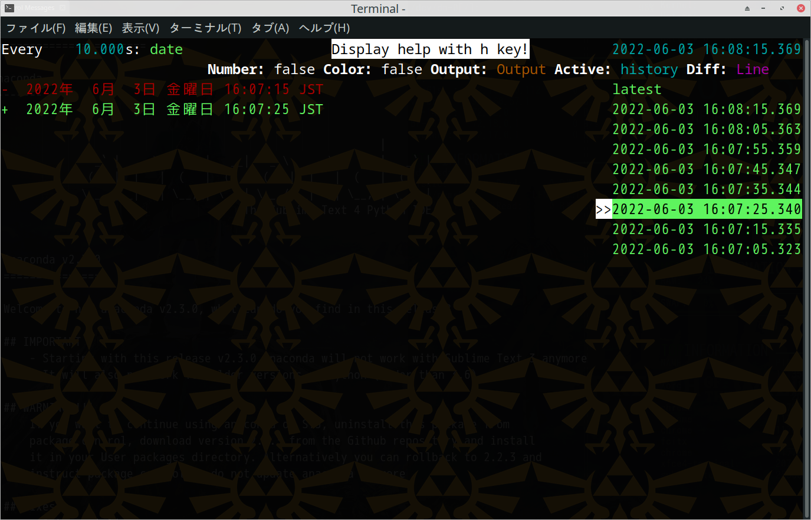
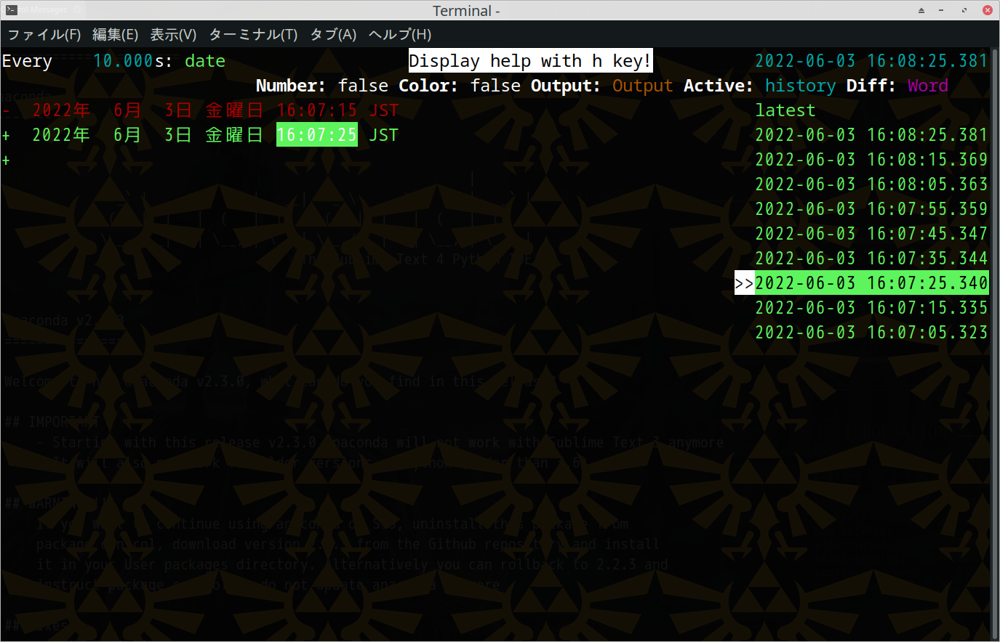

hwatch
======

hwatch - alternative watch command.

<p align="center">

</p>

## Description

`hwatch` is a alternative **watch** command.
That records the result of command execution and can display it history and diffs.

### Features

- Can keep the history when the difference, occurs and check it later.
- Can check the difference in the history. The display method can be changed in real time.
- Can output the execution result as log (json format).
- Support ANSI color code.
- Execution result can be scroll.
- Not only as a TUI application, but also to have the differences output as standard output.
- If a difference occurs, you can have the specified command additionally executed.

## Install

### macOS (brew)

    brew install hwatch

### macOS (MacPorts)

    sudo port install hwatch

### Arch Linux (AUR)

    paru -S hwatch

### Cargo Install

    cargo install hwatch

## Usage

        $ hwatch --help
        A modern alternative to the watch command, records the differences in execution results and can check this differences at after.

        Usage: hwatch [OPTIONS] [command]...

        Arguments:
          [command]...

        Options:
          -b, --batch                         output exection results to stdout
          -B, --beep                          beep if command has a change result
              --mouse                         enable mouse wheel support. With this option, copying text with your terminal may be harder. Try holding the Shift key.
          -c, --color                         interpret ANSI color and style sequences
          -r, --reverse                       display text upside down.
          -t, --no-title                      hide the UI on start. Use `t` to toggle it.
          -N, --line-number                   show line number
              --no-help-banner                hide the "Display help with h key" message
          -x, --exec                          Run the command directly, not through the shell. Much like the `-x` option of the watch command.
          -O, --diff-output-only              Display only the lines with differences during line diff and word diff.
          -A, --aftercommand <after_command>  Executes the specified command if the output changes. Information about changes is stored in json format in environment variable ${HWATCH_DATA}.
          -l, --logfile <logfile>             logging file
          -s, --shell <shell_command>         shell to use at runtime. can  also insert the command to the location specified by {COMMAND}. [default: "sh -c"]
          -n, --interval <interval>           seconds to wait between updates [default: 2]
              --tab-size <tab_size>           Specifying tab display size [default: 4]
          -d, --differences [<differences>]   highlight changes between updates [possible values: none, watch, line, word]
          -o, --output [<output>]             Select command output. [default: output] [possible values: output, stdout, stderr]
          -h, --help                          Print help
          -V, --version                       Print version


watch window keybind

| Key                           | Action                                                      |
|-------------------------------|-------------------------------------------------------------|
| <kbd>↑</kbd>, <kbd>↓</kbd>    | move selected screen(history/watch).                        |
| <kbd>←</kbd>                  | select watch screen.                                        |
| <kbd>→</kbd>                  | select history screen.                                      |
| <kbd>H</kbd>                  | show help window.                                           |
| <kbd>C</kbd>                  | toggle color.                                               |
| <kbd>R</kbd>                  | toggle reverse mode.                                               |
| <kbd>D</kbd>                  | switch diff mode.                                           |
| <kbd>N</kbd>                  | switch line number display.                                 |
| <kbd>T</kbd>                  | toggle the UI (history pane and header).                    |
| <kbd>Backspace</kbd>          | toggle the history pane.                                    |
| <kbd>Q</kbd>                  | exit hwatch.                                                |
| <kbd>0</kbd>                  | disable diff.                                               |
| <kbd>1</kbd>                  | switch watch type diff.                                     |
| <kbd>2</kbd>                  | switch line type diff.                                      |
| <kbd>3</kbd>                  | switch word type diff.                                      |
| <kbd>O</kbd>                  | switch output mode(output->stdout->stderr).                 |
| <kbd>Shift</kbd>+<kbd>O</kbd> | show only lines with differences(line/word diff mode only). |
| <kbd>F1</kbd>                 | only stdout print.                                          |
| <kbd>F2</kbd>                 | only stderr print.                                          |
| <kbd>F3</kbd>                 | print output.                                               |
| <kbd>+</kbd>                  | increase interval.                                          |
| <kbd>-</kbd>                  | decrease interval.                                          |
| <kbd>Tab</kbd>                | toggle select screen(history/watch).                        |
| <kbd>/</kbd>                  | filter history by string.                                   |
| <kbd>*</kbd>                  | filter history by regex.                                    |
| <kbd>Esc</kbd>                | unfiltering.                                                |

## Configuration

If you always want to use some command-line options, you can set them in the
`HWATCH` environment variable. For example, if you use `bash`, you can add
the following to your `.bashrc`:

```bash
export HWATCH="--no-title --color --no-help-banner"
```

## Example

### interval 10 second

Use the -n option to specify the command execution interval.

```bash
hwatch -n 3 command...
```

<p align="center">

</p>

### logging output

The command execution result can be output as a log in json format.

```bash
hwatch -n 3 -l hwatch_log.json command...
```

When you check the json log, you can easily check it by using [this script](https://gist.github.com/blacknon/551e52dce1651d2510162def5a0da1f0).

### Use shell function

If you want the shell function to be executed periodically, you can specify the shell command to be executed with -s as follows.

```bash
# bash
hwatch -n 3 -s 'bash -c "source ~/.bashrc"; {COMMAND}' command...

# zsh
hwatch -n 3 -s 'zsh -c "source ~/.zshrc"; {COMMAND}' command...
```

<p align="center">

</p>

### ANSI Color code

If you want to see output colored with ANSI color code, enable color mode.

To enable color mode, run hwatch with the `-c` option.
Alternatively, you can enable / disable the color mode with the <kbd>C</kbd> key during execution.

```bash
hwatch -n 3 -c command...
```

<p align="center">

</p>

### diff view

To enable color mode, run hwatch with the `-d` option.

There are several "diff modes" available.
Switching can be done with the <kbd>D</kbd> key.

```bash
hwatch -n 3 -d command...
```

#### watch diff

<p align="center">

</p>

#### line diff

<p align="center">

</p>

#### word diff

<p align="center">

</p>

### history filtering

You can filter history as a string with <kbd>/</kbd> key and as a regular expression with <kbd>*</kbd> key.

### run batch mode

You can have command diffs output directly to stdout instead with `-b` option of getting them as a TUI app.

```bash
hwatch -b command...
```
